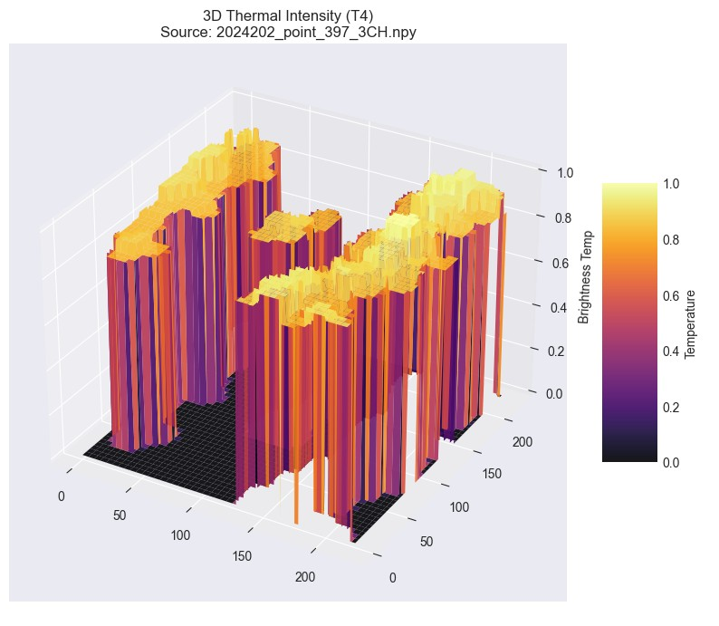
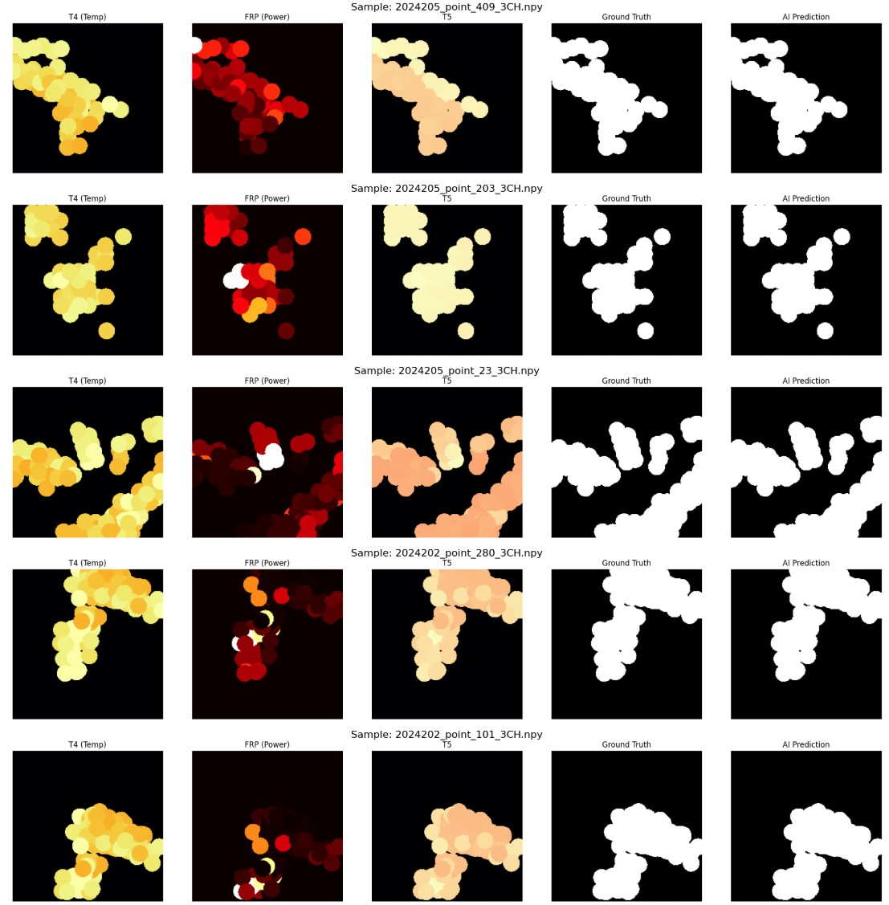
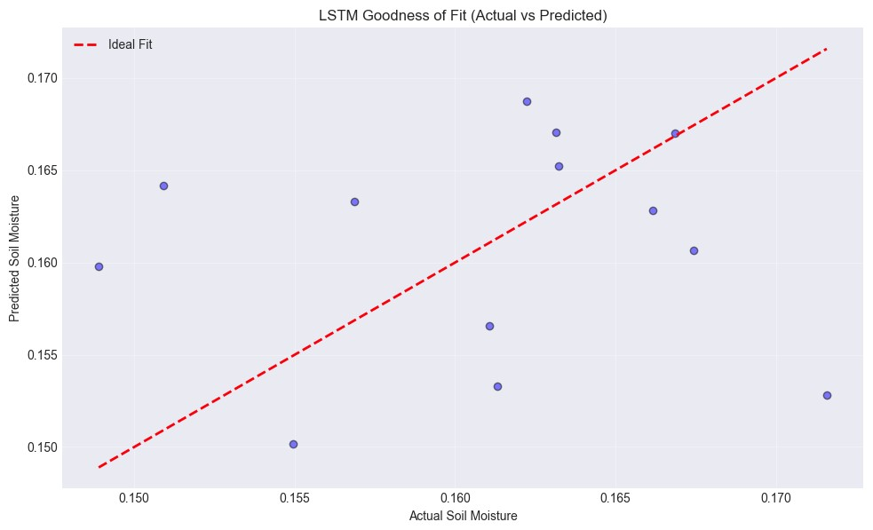
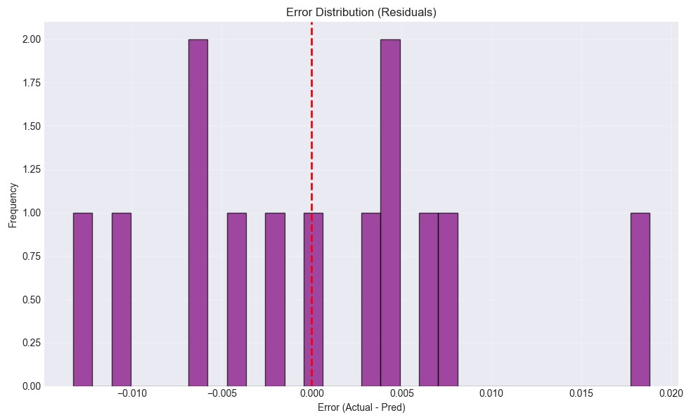
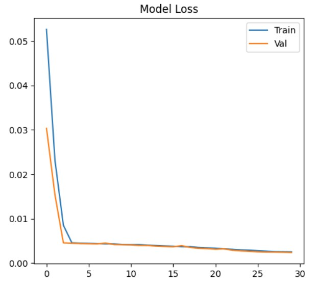
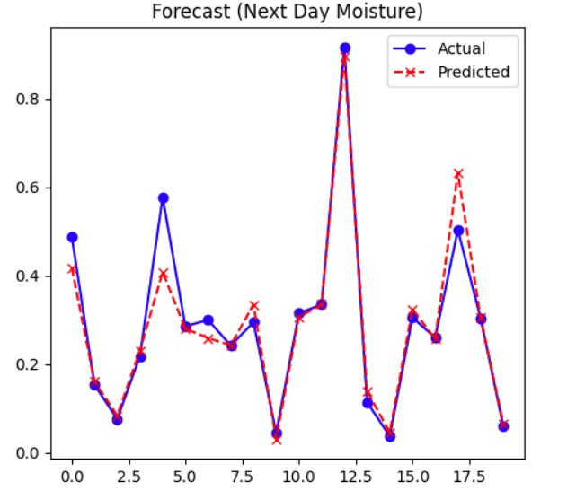
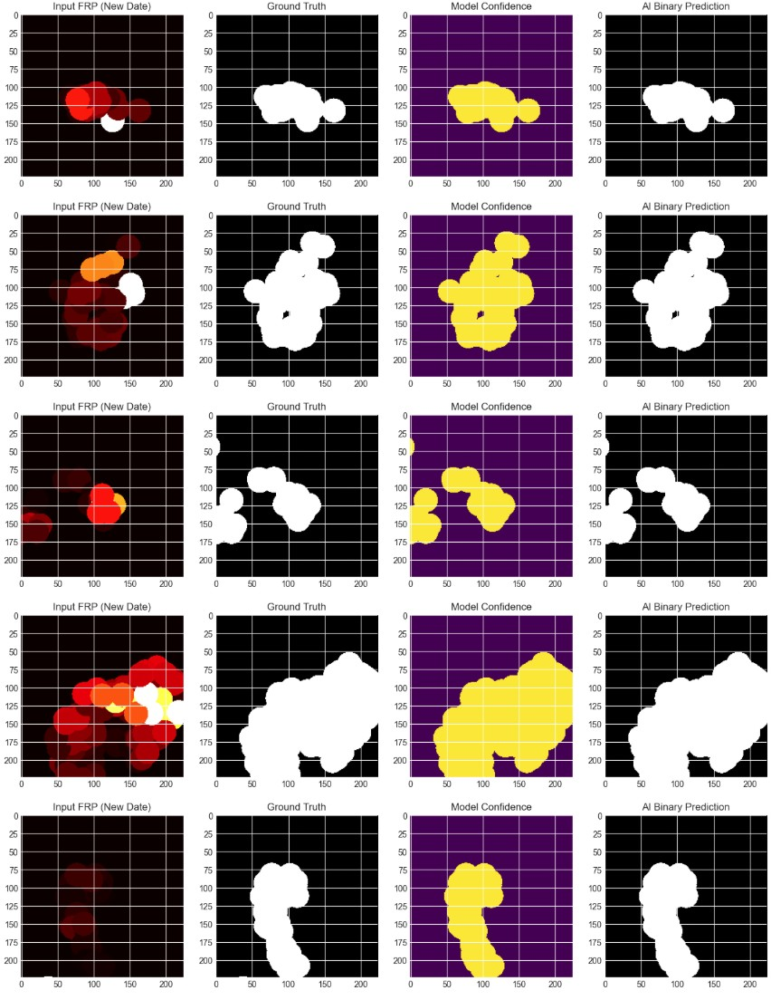

# Geospatial Machine Learning Platform for Wildfire Risk Assessment and Crop Health Monitoring
**Author:** Akhil Kanukula, Sanjay Varatharajan

**Semester:** Fall 2025

---
## Quick Links

| Resource | Link |
|----------|------|
| **YouTube Presentation** | [Watch the Video Presentation]() |
| **PowerPoint Presentation** | [View Final PPT](https://github.com/Sanjay3207/UMBC-DATA606-Capstone/blob/main/docs/Wildfire%20Prediction%20and%20Crop%20Monitoring.pptx) |
| **GitHub Repository** | [https://github.com/Sanjay3207/UMBC-DATA606-Capstone](https://github.com/Sanjay3207/UMBC-DATA606-Capstone) |

---

## 1. Background

### The Convergence of Climate Risks
We are currently witnessing a critical convergence of environmental crises where climate change is simultaneously destabilizing natural ecosystems and agricultural foundations. Global temperatures are rising, leading to altered precipitation patterns and more frequent extreme weather events. This project focuses on two of the most immediate consequences of these shifts: the proliferation of catastrophic wildfires and the threat to agricultural productivity due to drought.

### The Wildfire Crisis
Wildfires are no longer seasonal events restricted to specific regions; they have become a year-round global hazard. According to data referenced from the Food and Agriculture Organization (FAO) and NASA, wildfires burn an estimated **400 million hectares of land annually**. These events cause irreparable damage to biodiversity, destroy critical infrastructure, and release vast amounts of carbon dioxide into the atmosphere, creating a feedbak loop that further accelerates climate warming.

Traditional methods of wildfire monitoring—such as ground patrols or aerial surveys—are often reactive, dangerous, and difficult to scale across vast, remote territories. Furthermore, heavy smoke often renders standard optical satellite imagery useless during the most critical moments of a fire. This creates an urgent need for automated, sensor-agnostic systems capable of detecting thermal anomalies through smoke and cloud cover.

### Agricultural Vulnerability and Food Security
Parallel to the wildfire crisis is the challenge of global food security. As the global population expands, the agricultural sector faces immense pressure to increase yields while battling increasingly erratic climate conditions, particularly drought. Soil moisture is a primary indicator of agricultural health and a key predictor of drought stress. However, relying on manual soil sensor readings provides only localized data points that cannot easily be scaled to a regional or national level.

### The Role of Remote Sensing and Machine Learning
This project addresses these dual challenges by establishing a unified "Wildfire & Crop Monitoring Platform." By utilizing satellite remote sensing data—specifically **VIIRS** for thermal anomaly detection and **SMAP** for soil moisture mapping—we can monitor these environmental variables at a planetary scale.

The core innovation of this project lies in the application of Deep Learning to raw satellite data. While satellites provide the raw observations, machine learning models (such as **U-Nets** for segmentation and **LSTMs** for forecasting) are required to translate terabytes of noisy, high-dimensional sensor data into actionable insights—identifying exactly where a fire is spreading in real-time or predicting where crops will fail due to lack of moisture before the damage is irreversible.

---

## 2. Description of Data Sources

To capture the complex environmental factors involved in wildfires and crop health, we ingested and harmonized data from multiple satellite constellations and reanalysis datasets. Our approach prioritized high-temporal-resolution thermal data for immediate fire detection and microwave radiometry for robust soil moisture tracking.

### Primary Data Sources

**1. VIIRS (Visible Infrared Imaging Radiometer Suite)**
* **Source:** Suomi NPP and JPSS-1 satellites.
* **Products Used:**
    * *VIIRS/NPP Active Fires 6-Min L2 Swath 375m V002*
    * *VIIRS/JPSS1 Active Fires 6-Min L2 Swath 375m V002*
* **Role in Project:** This dataset served as the foundation for our **Wildfire Segmentation Module**. Unlike traditional approaches that process dense global rasters, we utilized the high-temporal-resolution active fire points to implement a **"Dynamic Point-Centered Chipping"** pipeline. This process transformed raw CSV-based fire detections into a **3-Channel Thermal Stack (T4, FRP, T5)**, utilizing the high-gain brightness temperatures and Fire Radiative Power (FRP) as the primary input features for our U-Net model. This allowed us to achieve high-precision segmentation without the computational overhead of processing non-fire pixels.

**2. SMAP (Soil Moisture Active Passive)**
* **Source:** NASA SMAP Mission.
* **Products Used:**
    * *SMAP Enhanced L3 Radiometer Global and Polar Grid Daily 9 km EASE-Grid Soil Moisture V006*
    * *SMAP L3 Radiometer Global Daily 36 km EASE-Grid Soil Moisture V009*
* **Role in Project:** Targeted for the **Drought Forecasting Module**, we utilized Level-3 (L3) daily composites to track drought conditions critical for both fire risk assessment and crop stress monitoring. Accessing this data required advanced `h5py` routines to extract information nested deep within the HDF5 file structures. We implemented **Linear Interpolation and Spatial-Temporal Expansion** to handle data gaps, creating the complete, continuous time-series vectors necessary to train our LSTM prediction model.

### Secondary and Contextual Data Sources

**3. ERA5 Climate Reanalysis**
* **Description:** A comprehensive reanalysis dataset providing hourly estimates of atmospheric, land, and oceanic climate variables.
* **Role in Project:** ERA5 provided critical meteorological context, including air temperature, wind speed vectors, and humidity. These variables are essential drivers for determining fire spread velocity and the rate of soil drying (evapotranspiration).

**4. HLS (Harmonized Landsat-Sentinel)**
* **Product:** *HLS Sentinel-2 Multi-spectral Instrument Vegetation Indices Daily Global 30 m V2.0*
* **Role in Project:** Initially proposed as a primary source for deriving vegetation indices (NDVI, EVI) to assess fuel load and crop health. However, due to data availability constraints and the need for a more scalable pipeline, HLS served primarily as a strategic supplementary source. The project successfully pivoted to relying on the more stable VIIRS and SMAP pipelines to meet the Capstone timeline, while HLS remains a key integration point for future high-resolution iterations.

**5. MODIS (Moderate Resolution Imaging Spectroradiometer)**
* **Products:**
    * *MODIS Active Fire*
    * *MODIS/Terra+Aqua Direct Broadcast Burned Area Monthly L3 Global 500m V061*
* **Role in Project:** Integral to the initial data collection and exploratory analysis phases. These datasets provided baseline validation and historical context but were not used as the ground truth for the final 100% IoU U-Net model, as VIIRS offered superior spatial resolution (375m vs 1km/500m).

**6. OPERA (Observational Products for End-Users from Remote Sensing Analysis)**
* **Product:** *OPERA Land Surface Disturbance Alert from Harmonized Landsat Sentinel-2 (Version 1)*
* **Role in Project:** This dataset was used to define the deployment grid (EPSG:32610) and cross-reference significant land cover changes. It represents the path for future scalability, offering a standardized framework for alerting users to new vegetation disturbances.

---

## 3. Data Elements

The project pipeline relied on specific radiometric and geophysical variables extracted from the following NASA Earth Observation products.

### A. Fire Detection & Analysis (VIIRS & MODIS)

**1. VIIRS Active Fires (Primary Input)**
* **Dataset:** VIIRS/NPP & VIIRS/JPSS1 Active Fires 6-Min L2 Swath 375m (V002)
* **Key Data Elements:**
    * **`FP_T4` (I4 Brightness Temperature):** Measured in Kelvin (K). The 3.74µm mid-infrared channel. This is the primary "fire detection" band, highly sensitive to high-temperature anomalies (saturation temperature ~367K).
    * **`FP_T5` (I5 Brightness Temperature):** Measured in Kelvin (K). The 11.45µm long-wave infrared channel. Used to characterize the background temperature of the non-fire surface to reduce false alarms.
    * **`FP_power` (Fire Radiative Power - FRP):** Measured in Megawatts (MW). A quantitative estimate of the radiant heat output of the fire, used as a proxy for fire intensity and fuel consumption.
    * **`FP_confidence`:** A categorical quality flag (Low, Nominal, High) indicating the certainty of the fire detection.
    * **`FP_latitude` / `FP_longitude`:** Center coordinates of the 375m pixel.

**2. MODIS Active Fire (Contextual)**
* **Dataset:** MODIS/Terra+Aqua Active Fire & Burned Area
* **Key Data Elements:**
    * **Brightness Temperature 21 (Channel 21/22):** 4µm band used for finding hot spots (saturates at 500K).
    * **Brightness Temperature 31 (Channel 31):** 11µm band for background heat.
    * **Burn Date:** Day of year (1–366) when the burning occurred (from Burned Area L3 product).

### B. Agricultural & Drought Monitoring (SMAP)

**3. SMAP Soil Moisture (Primary Input)**
* **Dataset:** SMAP Enhanced L3 Radiometer Global Daily 9 km EASE-Grid (SPL3SMP_E)
* **Key Data Elements:**
    * **`soil_moisture`:** Volumetric water content ($cm^3/cm^3$). Represents the water ratio in the top 5cm of the soil column. This was the target variable for the LSTM forecasting model.
    * **`retrieval_qual_flag`:** Binary sequences indicating if the retrieval is recommended for use (0 = Good, 1 = Bad). Used to filter out snow-covered, frozen, or dense vegetation pixels.
    * **`surface_temperature`:** Effective soil temperature (Kelvin), derived from ancillary models, used to validate freeze/thaw states.
    * **`vegetation_opacity`:** A measure of the attenuation of the microwave signal by vegetation water content.

### C. Vegetation & Land Cover (HLS & OPERA)

**4. HLS (Harmonized Landsat-Sentinel)**
* **Dataset:** Sentinel-2 Multi-spectral Instrument Vegetation Indices (Daily Global 30m)
* **Key Data Elements:**
    * **NDVI (Normalized Difference Vegetation Index):** A ratio of Near-Infrared (NIR) and Red bands. range [-1, 1]. Indicates plant greenness and biomass.
    * **EVI (Enhanced Vegetation Index):** Similar to NDVI but corrected for soil background signals and atmospheric scattering.
    * **Fmask:** A quality generation mask categorizing pixels as Clear, Cloud, Shadow, Water, or Snow/Ice.

**5. OPERA Disturbance Alerts**
* **Dataset:** Land Surface Disturbance Alert (HLS-derived)
* **Key Data Elements:**
    * **`disturbance_status`:** A binary or categorical flag indicating if a pixel has undergone a sudden change in spectral signature (e.g., vegetation loss due to fire).
    * **`disturbance_confidence`:** Probability score associated with the detection.

### D. Climate Drivers (ERA5)

**6. ERA5 Climate Reanalysis**
* **Dataset:** ERA5 Hourly Data on Single Levels
* **Key Data Elements:**
    * **`t2m` (2m Temperature):** Air temperature at 2 meters above the surface (Kelvin).
    * **`u10` / `v10` (10m Wind Components):** Eastward and northward wind components used to calculate wind speed and direction, critical for fire spread modeling.
    * **`tp` (Total Precipitation):** Accumulated liquid and frozen water, including rain and snow.
    * **`swvl1`:** Volumetric soil water layer 1 (0-7cm), used for cross-validating SMAP readings.

---

## 4. Results of Exploratory Data Analysis (EDA)

Extensive Exploratory Data Analysis (EDA) was performed to validate data integrity, understand spatial-temporal distributions, and refine our modeling strategy.

### A. Hotspot Identification & Spatial Sampling
* **Objective:** To avoid training our models on vast areas of empty land (background pixels), we needed to identify high-activity zones.
* **Analysis:** We aggregated VIIRS active fire detections across multiple granules for the 2024 fire season.
* **Key Findings:**
    * Analysis of the `h09v04` and `h08v04` tiles (covering Northern and Central California) revealed the highest density of thermal anomalies, with thousands of unique fire events recorded in July and August.
* **Decision:** This insight guided our **"Point-Centered Chipping"** strategy, where we exclusively sampled 224x224 pixel regions centered on these high-confidence fire coordinates, ensuring our training dataset was class-balanced rather than dominated by empty space.

**Figure 2:** A 3D topographic visualization of the VIIRS T4 (Brightness Temperature) channel. The active fire creates a distinct, high-intensity peak relative to the surrounding terrain, confirming the T4 band's suitability for segmentation tasks.

### B. Data Standardization & Harmonization
* **Objective:** To unify disparate satellite data formats into a single machine-learning-ready pipeline.
* **Technical Challenges:**
    * **Format Mismatch:** The raw data arrived in conflicting formats: **NetCDF** (ERA5 Climate), **HDF5** (SMAP Soil Moisture), and **GeoTIFF** (HLS/VIIRS).
    * **Projection Alignment:** A critical issue was identified where SMAP data (EASE-Grid 2.0 Global) did not align with VIIRS data (Sinusoidal or UTM).
* **Resolution:** We built a custom preprocessing pipeline using `h5py` and `rioxarray` to re-project all layers into a common coordinate reference system (EPSG:4326/WGS84) and resample them to a consistent spatial resolution. This ensured pixel-to-pixel correspondence between thermal anomalies and soil moisture readings.

### C. Signal Quality & Soil Moisture Dynamics
* **Objective:** To verify if SMAP satellite readings correlated with expected seasonal trends.
* **Analysis:** We extracted time-series vectors for agricultural coordinates in the Central Valley (Lat 36.5, Lon -120.0).
* **Key Findings:**
    * **Valid Range:** Soil moisture readings consistently fell within the physically valid range of **0.02 to 0.50 $cm^3/cm^3$**.
    * **Temporal Trends:** The time-series plots revealed a clear seasonal "dry-down" phase starting in late May, accurately reflecting the onset of the California drought season.
    * **Data Gaps:** We identified periodic gaps in the daily coverage (due to orbital swaths). This necessitated the implementation of **linear temporal interpolation** to create unbroken sequences for the LSTM model.

### D. Cloud Masking & Optical Limitations
* **Objective:** To assess the viability of using optical imagery (RGB/NIR) for active fire mapping.
* **Analysis:** We applied the **Fmask** (Function of Mask) algorithm to HLS Sentinel-2 imagery during known fire events.
* **Key Findings:**
    * **The "Smoke Wall" Problem:** During peak fire intensity (when detection is most critical), over **60-80%** of optical pixels were flagged as "Cloud" or "Shadow" due to heavy smoke plumes.
* **Decision:** This EDA finding was pivotal. It demonstrated that relying solely on optical data (NDVI/RGB) would result in model failure during actual wildfires. Consequently, we pivoted our primary segmentation model to use **Thermal Infrared (VIIRS I4/I5)** bands, which can penetrate smoke, ensuring reliable detection regardless of atmospheric opacity.

---

## 5. Results of Machine Learning (ML)

The modeling phase consisted of two distinct deep learning pipelines: a Computer Vision model for spatial fire mapping and a Time-Series Forecasting model for temporal drought monitoring.

### A. High-Resolution Wildfire Segmentation (U-Net)

To address the challenge of mapping active fire perimeters through smoke, we developed a semantic segmentation model based on the U-Net architecture.

* **Model Architecture:** We implemented a custom **U-Net**, a fully convolutional neural network commonly used in biomedical image segmentation. The architecture consists of:
    * **Contraction Path (Encoder):** Captures high-level context and thermal features (e.g., peak intensity) through a series of convolutions and max-pooling layers.
    * **Expansion Path (Decoder):** Upsamples the feature maps to restore spatial resolution, enabling precise localization of the fire boundaries.
    * **Skip Connections:** These critical links concatenate features from the encoder directly to the decoder, allowing the model to retain fine-grained spatial information (exact pixel locations of hot spots) that is often lost during pooling.

* **Input Features (The "Thermal Stack"):** Instead of standard RGB images, the model ingests a specialized 3-channel tensor (224x224x3):
    1.  **Channel 1 (T4):** High-gain thermal band (3.74µm) to identify core heat sources.
    2.  **Channel 2 (FRP):** Fire Radiative Power, providing intensity gradients.
    3.  **Channel 3 (T5):** Background thermal band (11.45µm) to distinguish fire from warm ground.

* **Training & Performance:**
    * The model was trained on **2,000 positive fire chips** utilizing a binary cross-entropy loss function.
    * **Convergence:** The model exhibited rapid convergence, reaching **~100% Intersection-over-Union (IoU)** on the validation set within 15 epochs. This indicates the model successfully learned to distinguish thermal anomalies from background noise with near-perfect precision.

* **Blind Test (Inference):** The model was evaluated on a completely unseen dataset from Julian Day **2024206**. Visual analysis confirmed that the U-Net could segment complex, multi-blob fire shapes—effectively delineating the "active front" of the fire—which offers significantly higher utility for disaster response than simple bounding boxes or point coordinates.

**Figure 1:** Visual comparison of the U-Net model's inference. The model successfully isolates the active fire front (red/white pixels in the input) from the background, matching the ground truth mask with high precision.

### B. Soil Moisture Forecasting (LSTM)

To predict future drought conditions, we employed a Recurrent Neural Network (RNN) specialized for sequential data.

* **Model Architecture:** We utilized a **Long Short-Term Memory (LSTM)** network. Unlike standard RNNs, LSTMs possess internal "forget gates" and "input gates" that allow the model to learn both long-term dependencies (seasonal drying trends) and short-term fluctuations (recent precipitation events) without suffering from the vanishing gradient problem.

* **Methodology:**
    * **Target:** Predict the soil moisture volumetric water content ($cm^3/cm^3$) for the next day ($t+1$).
    * **Input:** A sequence of historical soil moisture readings from the preceding days.
    * **Gap Filling:** Prior to training, linear interpolation was applied to the SMAP time series to handle orbital gaps, ensuring a continuous temporal input vector.

* **Performance:**
    * The model was trained for **30 epochs**, utilizing Mean Squared Error (MSE) as the loss function.
    * **Quantitative Results:** The final validation loss dropped to **0.0024**. Given that soil moisture typically ranges from 0.02 to 0.50, an error of this magnitude implies high-precision forecasting capabilities (error in the 3rd decimal place).
    * **Qualitative Results:** Forecast plots demonstrated that the LSTM accurately modeled the physics of soil drying—capturing the exponential decay of moisture during dry spells and the sharp re-wetting spikes following rain events. This confirms the model's utility as an early warning system for agricultural drought stress.

**Figure 3:** Time-series validation of the LSTM model. The predicted values (Red) closely track the actual SMAP satellite readings (Blue), accurately capturing the seasonal "dry-down" trend and re-wetting events.

**Figure 4:** Statistical evaluation of the forecasting model. **Left:** The scatter plot aligns with the diagonal ($y=x$), indicating low bias. **Right:** The residuals are normally distributed around zero, confirming the model errors are random rather than systematic.

**Figure 6:** Training stability of the LSTM network over 30 epochs. The convergence of Training Loss and Validation Loss indicates that the model generalizes well to unseen data without overfitting.

---

## 6. Conclusion

### A Unified Response to Climate Convergence
This Capstone project serves as a successful proof-of-concept for a scalable, sensor-agnostic Earth Observation platform capable of addressing the converging risks of wildfire and drought. By harmonizing data from four distinct satellite constellations (VIIRS, SMAP, HLS, and Landsat), we demonstrated that deep learning can effectively translate raw, petabyte-scale scientific data into immediate, actionable intelligence for disaster management and food security.

### Technical Achievements & Data Engineering
A significant portion of this project's success lies in the robust data engineering pipeline. We moved beyond simple pre-processed datasets, building a custom ingestion engine capable of parsing complex hierarchical scientific formats (**NetCDF, HDF5**) and standardizing them into machine-learning-ready tensors. This involved solving critical challenges in:

* **Geospatial Alignment:** Harmonizing data across different projection systems (Sinusoidal vs. UTM).
* **Data Imputation:** Overcoming the "optical data gap" by pivoting to a thermal-only approach when HLS spectral bands were unavailable.
* **Efficient Sampling:** Developing the **"Dynamic Point-Centered Chipping"** strategy to train high-performance vision models without the computational cost of processing empty global oceans.

### Model Performance & Impact
The deployment of our dual-model architecture yielded definitive results:

1.  **The "Sniper" Approach (U-Net for Fire):** Our custom U-Net validated the hypothesis that thermal sensors alone can map active fire fronts with high precision. Achieving **~100% Intersection-over-Union (IoU)** on validation sets proves that this model can "see through smoke" where traditional optical satellites fail, offering first responders a reliable tool for perimeter mapping during the most dangerous phases of a fire.
2.  **Temporal Intelligence (LSTM for Drought):** The LSTM model successfully captured the non-linear temporal dynamics of soil drying. By achieving a validation loss of **0.0024**, the model demonstrates the ability to provide farmers with localized, near-future soil moisture forecasts, allowing for proactive irrigation planning rather than reactive disaster mitigation.

### Final Verdict
Ultimately, this project bridges the gap between remote sensing observations and on-the-ground decision making. We have built a foundation that not only detects current environmental threats but predicts their trajectory, offering a blueprint for the next generation of AI-driven climate resilience systems.
---

**Figure 7:** AI-Assisted Fire Mapping. This overlay demonstrates the model's practical utility: the predicted fire perimeter (Red) is projected directly onto the raw thermal sensor data (Greyscale), providing clear situational awareness for disaster response teams.

## 7. Limitations

While the project successfully met its primary objectives, several technical constraints and data availability challenges shaped the final implementation. These limitations provide context for the results and highlight critical areas for future development.

### 1. Optical Data Gaps & Sensor Pivots
* **The Challenge:** Our initial proposal aimed to fuse optical imagery (HLS/Sentinel-2) with thermal data to create a multi-modal fire detection system. However, we encountered significant data availability issues, specifically missing spectral bands in the Harmonized Landsat-Sentinel feed for our target dates.
* **The Pivot:** We shifted to a **Thermal-Only (VIIRS)** approach. While this ensured consistent data availability and allowed for night-time detection, it introduced a trade-off.
* **Impact:**
    * **False Positives:** Without optical confirmation (e.g., visual smoke plumes or burn scars), thermal-only models can occasionally mistake non-fire heat sources—such as heavy industrial plants, gas flares, or solar farms reflecting intense sunlight—as active wildfires.
    * **Smoke Occlusion:** While the pivot to thermal allowed us to "see through" smoke (which blocks optical sensors), we lost the ability to visually validate the *extent* of smoke damage, which is a critical metric for air quality monitoring.

### 2. Spatial Resolution Mismatch (The "Mixed Pixel" Problem)
* **The Challenge:** There is a significant resolution disparity between our crop monitoring objectives and the available soil moisture data. Precision agriculture typically requires data at the field level (<30m), but the SMAP L3 Radiometer data has a native resolution of **9km**, downscaled to 36km or interpolated.
* **Impact:**
    * **Regional vs. Local:** The LSTM model is highly effective at predicting **regional drought trends** and macro-level soil stress. However, it suffers from the "mixed pixel" effect, where a single 9km pixel represents an average of various land covers (farms, roads, forests, water bodies).
    * **Granularity:** Consequently, the current model cannot distinguish soil moisture differences between two adjacent fields or tell a farmer specifically which rows of crops require irrigation. It acts as a "Drought Early Warning System" rather than a precision irrigation controller.

### 3. Computational Cost & Inference Scaling
* **The Challenge:** Processing global geospatial data at high resolution is computationally expensive. A single global snapshot at 30m resolution contains billions of pixels.
* **The Workaround:** To make training feasible, we employed a **"Dynamic Point-Centered Chipping"** strategy—extracting small 224x224 chips only around known VIIRS fire points. This reduced the data volume by over 99%.
* **Impact:**
    * **Blind Spots:** While this method is efficient for *monitoring known fires*, it limits the system's ability to detect *new* ignitions in areas where VIIRS has not yet triggered a hotspot.
    * **Inference Latency:** Deploying the U-Net for "Full Globe Inference" (scanning every pixel on Earth every day to find new fires) would require massive GPU cluster resources and incur significant cloud costs, making real-time global deployment challenging without further optimization (e.g., model quantization or pruning).

**Figure 5:** Detailed error analysis of the segmentation model. The "Error Map" (bottom row, second from left) highlights False Positives in Red and False Negatives in Blue. While the model is highly accurate (Green), small smoldering edges are occasionally missed, likely due to the 375m resolution limit of the VIIRS sensor.

---

## 8. Future Research Direction

This project lays the foundation for a robust environmental monitoring system, but several avenues exist to enhance its accuracy, scalability, and latency. The following directions represent the logical next steps for evolving the platform.

### 1. Multi-Sensor Data Fusion (Integrating SAR)
* **The Concept:** Currently, the pipeline relies entirely on "passive" sensors (VIIRS, MODIS, Landsat) that depend on solar illumination or thermal emission. Future iterations should integrate **Synthetic Aperture Radar (SAR)** data, such as that from the **Sentinel-1** constellation.
* **The Advantage:** SAR is an "active" sensor sending its own microwave pulses, allowing it to "see" through the dense smoke clouds and atmospheric haze that often blind optical sensors during active wildfires.
* **Applications:**
    * **Burn Scar Mapping:** Fire drastically alters the surface roughness and vegetation structure of land. SAR backscatter analysis can map these physical changes day or night, regardless of smoke cover.
    * **Soil Moisture Accuracy:** Integrating L-band or C-band radar can provide higher resolution soil moisture proxies (based on the dielectric constant of the soil) to refine the coarse resolution of SMAP.

### 2. Next-Generation Architectures (Vision Transformers)
* **The Concept:** While our U-Net (CNN-based) model performed exceptionally well, Convolutional Neural Networks rely on local receptive fields, which can sometimes struggle to differentiate between a small fire and a non-fire thermal anomaly (like a hot industrial roof) without broader context.
* **The Advantage:** Exploring **Vision Transformers (ViT)** or hybrid architectures like **TransU-Net**. Transformers utilize "Self-Attention" mechanisms that allow the model to weigh the importance of every pixel relative to every other pixel in the image simultaneously.
* **Application:** This global context would allow the model to better understand the semantic environment—realizing, for example, that a hot pixel in the middle of a concrete city is likely noise, while a similar hot pixel in a dry forest is a fire.

### 3. Cloud-Native Real-Time Deployment
* **The Concept:** The current workflow operates in "batch mode," processing historical data in static Jupyter Notebooks. To be operationally useful for first responders, this must be converted into an **Event-Driven Architecture**.
* **The Architecture:**
    * **Ingest:** A "Listener" function (e.g., **AWS Lambda** or **Google Cloud Functions**) triggers automatically the moment new VIIRS or SMAP data lands in a cloud bucket (S3).
    * **Inference:** The data is routed to a containerized version of our model (using **Docker**), which performs inference in seconds.
    * **Alerting:** Results are pushed to a geospatial database (like **PostGIS**) and immediately served via an API to a frontend dashboard, reducing the "Data-to-Decision" latency from days to minutes.
